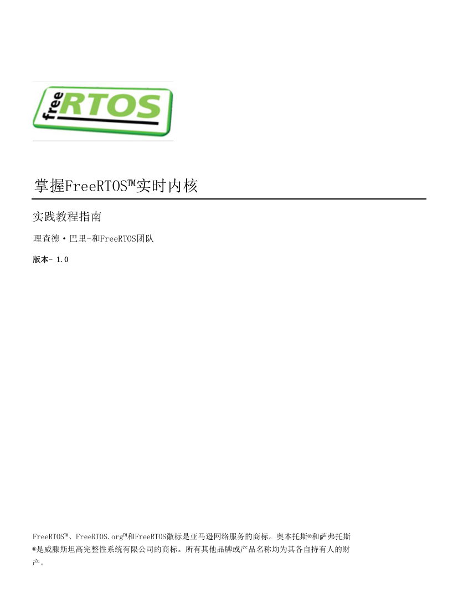

# 《Mastering the FreeRTOS Real Time Kernel》中文译本

这是 FreeRTOS 官方教程《Mastering the FreeRTOS Real Time Kernel》的中文译本，旨在为中文读者提供更便于阅读和检索的 PDF 版本。

  

## 下载

- [在线查看或下载中文 PDF](./Mastering-the-FreeRTOS-Real-Time-Kernel.v1.0_中文译本.pdf)
- [查看历史发布版本](https://github.com/brokensnow2/FreeRTOS-Kernel-Chinese-PDF/releases)
- [下载对应的英文原版 V1.0](https://github.com/FreeRTOS/FreeRTOS-Kernel-Book/releases/download/V1.0/Mastering-the-FreeRTOS-Real-Time-Kernel.v1.0.pdf)

## 版本说明

书籍版本和 FreeRTOS Kernel 源码版本是两套独立的版本体系，不应混为一谈。

| 项目 | 版本 | 说明 |
| --- | --- | --- |
| 当前中文译本 | FreeRTOS Kernel Book V1.0 | PDF 封面标注为 Version 1.0 |
| 对照英文原版 | FreeRTOS Kernel Book V1.0 | 当前翻译所依据的英文版本 |
| 源码化验证版 | FreeRTOS Kernel Book V1.1.0 | 已完成第 1 至 2 章，尚未替换稳定 PDF |
| 上游最新书籍 | FreeRTOS Kernel Book V1.1.0 | 已固定 Markdown 和媒体快照 |
| FreeRTOS Kernel 源码 | 独立版本体系 | V10.x、V11.x 等内核版本不等同于书籍版本 |

PDF 文件名中的 `V1.0` 指 FreeRTOS Kernel Book 的书籍版本，不代表 FreeRTOS Kernel 源码版本。当前中文译本不应被视为官方 V1.1.0 的完整翻译。

上游 V1.1.0 主要修订了优先级继承说明、任务通知内存占用以及少量代码清单和格式问题。版本差异可查看 [V1.0...V1.1.0 官方对比](https://github.com/FreeRTOS/FreeRTOS-Kernel-Book/compare/V1.0...V1.1.0)。

## 源文件与自动构建

本仓库正在迁移到更适合多人协作的源码化维护方式：

- [`upstream/`](./upstream/) 固定保存官方 V1.1.0 Markdown、媒体和许可文件，对应提交 `f3e284bbdd1e1489c9d59c3cea477ae58855a0c9`。
- [`zh-CN/`](./zh-CN/) 保存与英文上游同结构的中文 Markdown。
- PDF 由 Node.js、Playwright 和统一样式自动生成，不再作为人工编辑的源文件。
- 当前已完成第 1 至 2 章全文翻译和构建验证；全部章节完成并审阅前，V1.0 仍是稳定下载版本。

运行 `pnpm run preview` 会依次检查章节结构、生成 PDF 并验证产物，在 `output/pdf/` 得到第 1 至 2 章验证版。Windows 用户也可以直接运行 `build-pdf.cmd`。相关 Pull Request 会通过 GitHub Actions 提供可下载的预览 PDF。

详细说明见 [源码化翻译与 PDF 构建流程](./docs/source-workflow.md)。

## 翻译与校对

本译本的初稿由机器翻译生成，随后经过人工完整通读，并持续修订术语、错字、漏翻和排版问题。

当前 PDF：

- 已删除早期阅读过程中留下的全部个人标注。
- 已加入中文书签，便于按章节和小节跳转。
- 保留原书中的图片、表格和英文示例代码。
- 可能存在错译、漏翻、术语不一致或排版问题。

本项目不是 FreeRTOS 官方中文版本。涉及 API 行为、内核配置、安全性或实时性要求时，请以英文原版、FreeRTOS 官方文档和实际源码为准。

## 反馈问题

欢迎通过 [Issue 模板](https://github.com/brokensnow2/FreeRTOS-Kernel-Chinese-PDF/issues/new/choose) 报告问题。为了便于核对和修订，请尽量提供：

- 中文 PDF 页码和章节位置。
- 当前中文内容及对应英文原文。
- 建议译法或期望的排版效果。
- 必要的截图或代码清单编号。

翻译错误、错字、图片、表格、代码清单和书签问题均有对应的 Issue 模板。AI 维护工具只提供分类和维护参考注释，不代表维护者正式回复或处理承诺。

## 参与贡献

欢迎提交 Issue 或 Pull Request，共同改进译文和 PDF 质量。提交修改前请阅读：

- [贡献指南](./CONTRIBUTING.md)
- [Issue 维护流程](./docs/issue-maintenance.md)

适合贡献的内容包括单句翻译修正、术语统一、错字修复、书签调整、图片和表格排版修复，以及示例代码清单校正。

## 相关资源

- [FreeRTOS Kernel Book 官方仓库](https://github.com/FreeRTOS/FreeRTOS-Kernel-Book)
- [FreeRTOS Kernel Book 官方发布页](https://github.com/FreeRTOS/FreeRTOS-Kernel-Book/releases)
- [FreeRTOS Kernel 源码仓库](https://github.com/FreeRTOS/FreeRTOS-Kernel)
- [FreeRTOS 官方文档](https://www.freertos.org/Documentation/00-Overview)
- [FreeRTOS 社区论坛](https://forums.freertos.org/)

## 许可证与声明

原书由 Richard Barry 和 FreeRTOS 团队编写，相关版权归原作者及 Amazon Web Services 所有。原书及本中文翻译依照 [Creative Commons Attribution-ShareAlike 4.0 International](./LICENSE) 许可协议分发。

本仓库与 Amazon Web Services 或 FreeRTOS 官方不存在隶属、赞助或认可关系。FreeRTOS 及相关标识是其各自权利人的商标。
